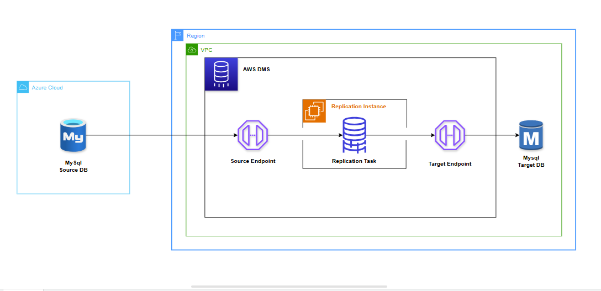

# Retail_DB Migration: Azure MySQL → AWS RDS MySQL using AWS DMS (Full Load + CDC)

This project demonstrates end-to-end **database migration** from **Azure Database for MySQL** to **AWS RDS for MySQL** using **AWS Database Migration Service (DMS)**. It includes both **full load** and **ongoing replication (CDC)**.

---

## 🧭 Project Overview

| Component | Description |
|------------|-------------|
| **Source** | Azure Database for MySQL Flexible Server |
| **Target** | AWS RDS MySQL Instance |
| **Migration Tool** | AWS Database Migration Service (DMS) |
| **Migration Type** | Full Load + Change Data Capture (CDC) |
| **Database Name** | retail_db |

The database contains typical retail domain entities — customers, orders, products, payments, shipments, and inventory.

---

## 🧱 Architecture Diagram

This project uses AWS DMS to migrate data from Azure MySQL (source) to AWS RDS MySQL (target).  
Full load and CDC (Change Data Capture) are configured for real-time replication.



---

## 🧰 Prerequisites

- Azure Database for MySQL instance (with binary logging enabled)
- AWS RDS for MySQL target instance
- AWS DMS replication instance
- MySQL client tools
- SSL certificate (DigiCertGlobalRootG2.crt.pem)

---

## ⚙️ Azure MySQL Configuration

The following server parameters must be configured in Azure:

| Parameter | Value |
|------------|--------|
| log_bin | ON |
| binlog_format | ROW |
| binlog_row_image | FULL |
| binlog_expire_logs_seconds | 604800 |
| log_slave_updates | ON |
| sync_binlog | 1 |
| innodb_flush_log_at_trx_commit | 1 |
| gtid_mode | OFF |
| enforce_gtid_consistency | OFF |
| event_scheduler | ON |
| binlog_checksum | CRC32 *(read-only)* |

**Screenshot:** `azure-server-config.png`

---

## 👤 DMS User Setup on Source (Azure)

```sql
CREATE USER 'dms_user'@'%' IDENTIFIED BY 'StrongPassword!';
GRANT SELECT, REPLICATION SLAVE, REPLICATION CLIENT, SHOW VIEW ON *.* TO 'dms_user'@'%';
FLUSH PRIVILEGES;
```

**Screenshot:** `azure-mysql.png`

---

## 🗂️ Source Database Verification

### Check tables and counts
```sql
USE retail_db;
SHOW TABLES;
SELECT COUNT(*) FROM customers;
SELECT COUNT(*) FROM orders;
```
**Screenshots:**
- `source-db-table-list.png`
- `source-db-cust&ord-list.png`

---

## 🔐 SSL Certificate for DMS Connection

The Azure MySQL SSL root certificate used in DMS endpoint configuration:
```
DigiCertGlobalRootG2.crt.pem
```

**Screenshot:** `DigiCertGlobalRootG2.crt.pem`

---

## 🧩 AWS DMS Configuration

1. **Create Replication Instance**  
   - Type: `dms.t3.medium` or larger  
   - Subnet Group: VPC with access to both Azure and RDS.

2. **Create Endpoints:**
   - **Source Endpoint:** Azure MySQL (`dms_user@<server>.mysql.database.azure.com`)
   - **Target Endpoint:** AWS RDS MySQL
   - SSL mode: `require`

**Screenshot:** `dms.png`

---

## 🔄 DMS Task Creation

| Setting | Value |
|----------|--------|
| Migration type | Migrate existing data and replicate ongoing changes |
| Target table prep mode | Do nothing |
| Include LOB columns | Full LOB mode |
| Stop task after full load | ❌ (unchecked) |
| Change processing tuning | Batch commit interval = 1s |

**Screenshot:** `migration-arch.png`

---

## 📊 DMS Task Monitoring

Once full load completes, the CDC phase begins.

**Screenshots:**
- `dms-table-stats.png` (Table statistics)
- `cloudwatch-logs.png` (CDC progress logs)

---

## 🧪 CDC Testing

### Run on Azure (Source):
```sql
USE retail_db;
INSERT INTO customers (customer_id, first_name, last_name, email, phone, address, city, state, country, postal_code, created_at, updated_at)
VALUES (600001, 'CDC', 'Test', 'cdc.test@example.com', '+911234567600', '600 CDC Lane', 'Mumbai', 'MH', 'IN', '400001', NOW(), NOW());

UPDATE customers SET city='Pune' WHERE customer_id=600001;
DELETE FROM customers WHERE customer_id=600001;
```

**Screenshot:** `source-cdc.png`

### Verify on AWS RDS (Target):
```sql
SELECT * FROM retail_db.customers WHERE customer_id=600001;
```
**Screenshot:** `target-cdc.png`

---

## 🧾 Target Database Verification

Before migration:
**Screenshot:** `target-db-before-migration.png`

After migration and CDC sync:
**Screenshot:** `rds-mysql.png`

---

## 📊 Results Summary

| Phase | Status |
|--------|---------|
| Schema migration | ✅ Completed |
| Full data load | ✅ Completed |
| Ongoing CDC replication | ✅ Working |
| Source changes replicated | ✅ Verified |

---

## 📁 File Inventory

| File | Description |
|------|-------------|
| azure-server-config.png | Azure MySQL server parameters |
| azure-mysql.png | DMS user creation verification |
| source-db-table-list.png | Source schema tables |
| source-db-cust&ord-list.png | Customer and order table preview |
| source-cdc.png | Source CDC test queries |
| target-cdc.png | Target CDC verification |
| target-db-before-migration.png | Target DB before migration |
| rds-mysql.png | Final RDS verification |
| dms.png | AWS DMS endpoints setup |
| dms-table-stats.png | AWS DMS table-level replication status |
| cloudwatch-logs.png | DMS CDC log evidence |
| migration-arch.png | Overall architecture diagram |

---

## 🧩 Troubleshooting Checklist

| Issue | Fix |
|--------|-----|
| DMS CDC not starting | Check `binlog_format=ROW`, `binlog_row_image=FULL`, and privileges |
| CDC stops mid-way | Ensure `binlog_expire_logs_seconds >= 604800` |
| Access denied for dms_user | Use admin user for inserts, DMS user for reading |
| GTID errors | Set `gtid_mode=OFF` and `enforce_gtid_consistency=OFF` in Azure |

---

## 📘 Author & Credits

- **Author:** Your Name  
- **Date:** November 2025  
- **Project:** Azure to AWS MySQL Migration (Full Load + CDC)

---

## 🏁 Final Validation

✅ Migration successful  
✅ Real-time CDC replication working  
✅ Data consistency verified  
✅ Project documented and ready for GitHub showcase
